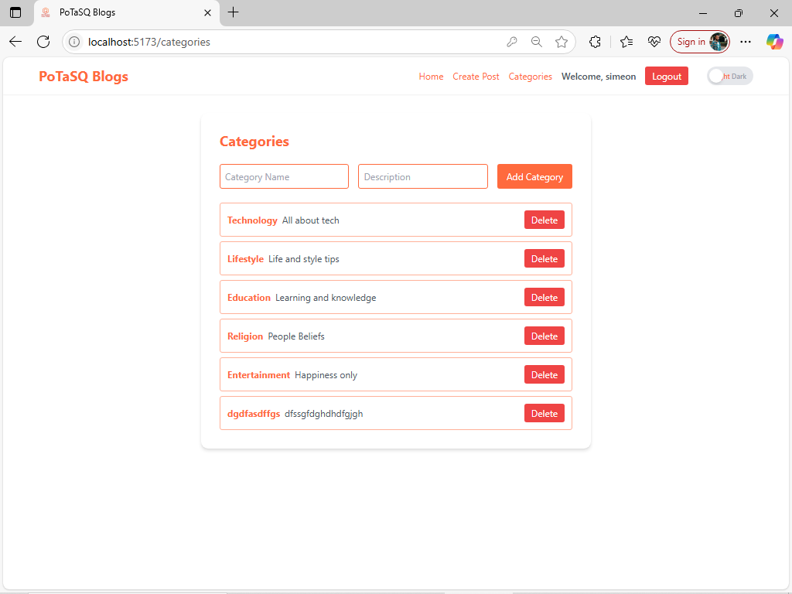

# PoTaSQ Blogs

A full-stack blog application built with **MongoDB**, **Express**, **React**, and **Node.js** (MERN).  
Users can register, log in, create posts with images, comment on posts, reply to comments, and interact with categories.  
Admin users can manage categories and moderate content.

---

## Table of Contents

- [Features](#features)
- [Screenshots](#screenshots)
- [Tech Stack](#tech-stack)
- [Setup & Installation](#setup--installation)
- [Environment Variables](#environment-variables)
- [API Documentation](#api-documentation)
  - [Auth Routes](#auth-routes)
  - [Post Routes](#post-routes)
  - [Category Routes](#category-routes)
  - [Ping Route](#ping-route)
- [Authentication & Authorization](#authentication--authorization)
- [File Uploads](#file-uploads)
- [License](#license)

---

## Features

- User registration and login (JWT-based authentication)
- Create, edit, and delete blog posts (with image upload)
- Comment on posts and reply to comments
- Category management (admin only)
- Responsive UI with light/dark theme toggle
- Admin-only actions for category and post moderation

---

## Screenshots

| Page                | Screenshot                                             |
|---------------------|--------------------------------------------------------|
| Welcome Page        |          |
| Home (All Posts)    |                |
| Single Post View    |  |
| Create Post         |    |
| Edit Post           |        |
| Categories (Admin)  |  |
| Dark Mode           |            |

> _Screenshots are located in the `screenshots/` folder and named after the pages._

---

## Tech Stack

- **Frontend:** React, Vite, Tailwind CSS, Axios
- **Backend:** Node.js, Express, Mongoose, Multer (for image uploads), JWT
- **Database:** MongoDB (local)
- **Authentication:** JWT (JSON Web Token)

---

## Setup & Installation

### Prerequisites

- [Node.js](https://nodejs.org/) (v16+ recommended)
- [pnpm](https://pnpm.io/) (or use npm/yarn)
- [MongoDB Community Server](https://www.mongodb.com/try/download/community) running locally

### 1. Clone the repository

```bash
git clone <your-repo-url>
cd week-4-mern-integration-assignment-smunyondi
```

### 2. Install dependencies

#### Backend

```bash
cd server
pnpm install
```

#### Frontend

```bash
cd ../client
pnpm install
```

### 3. Configure environment variables

Create a `.env` file in the `server` directory:

```env
MONGODB_URI=mongodb://localhost:27017/mern-blog
JWT_SECRET=your_jwt_secret_here
VITE_API_BASE_URL=http://localhost:5000
```

> **Note:** Replace `your_jwt_secret_here` with a strong secret key.

### 4. Start MongoDB

Make sure MongoDB is running locally (default port 27017):

```bash
mongod
```

### 5. Start the backend server

```bash
cd server
pnpm run dev
```

### 6. Start the frontend development server

```bash
cd ../client
pnpm run dev
```

- Frontend: [http://localhost:5173](http://localhost:5173)
- Backend API: [http://localhost:5000/api](http://localhost:5000/api)

---

## Environment Variables

Create a `.env` file in the `server` directory with the following:

```env
MONGODB_URI=mongodb://localhost:27017/mern-blog
JWT_SECRET=your_jwt_secret_here
VITE_API_BASE_URL=http://localhost:5000
```

---

## API Documentation

### Auth Routes

| Method | Endpoint              | Description             | Body / Params                | Auth Required |
|--------|-----------------------|-------------------------|------------------------------|--------------|
| POST   | `/api/auth/register`  | Register a new user     | `{ username, email, password }` | No           |
| POST   | `/api/auth/login`     | Login and get JWT token | `{ email, password }`        | No           |

#### Example Response (Login)

```json
{
  "token": "jwt_token_here",
  "user": {
    "id": "user_id",
    "username": "john",
    "email": "john@example.com",
    "isAdmin": false
  }
}
```

---

### Post Routes

| Method | Endpoint                | Description                        | Body / Params                                 | Auth Required |
|--------|-------------------------|------------------------------------|-----------------------------------------------|--------------|
| GET    | `/api/posts`            | Get all posts (paginated, filter)  | `page`, `limit`, `category`, `search`         | No           |
| GET    | `/api/posts/:id`        | Get a single post by ID            | -                                             | No           |
| POST   | `/api/posts`            | Create a new post (with image)     | `title`, `content`, `category`, `image` (form-data) | Yes          |
| PUT    | `/api/posts/:id`        | Edit a post (author/admin only)    | `title`, `content`, `category`, `image` (form-data) | Yes          |
| DELETE | `/api/posts/:id`        | Delete a post (author/admin only)  | -                                             | Yes          |

#### Comments & Replies

| Method | Endpoint                                                      | Description                        | Body / Params                  | Auth Required |
|--------|---------------------------------------------------------------|------------------------------------|-------------------------------|--------------|
| POST   | `/api/posts/:id/comments`                                     | Add a comment to a post            | `{ content }`                 | Yes          |
| PUT    | `/api/posts/:postId/comments/:commentId`                      | Edit a comment                     | `{ content }`                 | Yes          |
| DELETE | `/api/posts/:postId/comments/:commentId`                      | Delete a comment                   | -                             | Yes          |
| POST   | `/api/posts/:postId/comments/:commentId/replies`              | Add a reply to a comment           | `{ content }`                 | Yes          |
| PUT    | `/api/posts/:postId/comments/:commentId/replies/:replyId`     | Edit a reply                       | `{ content }`                 | Yes          |
| DELETE | `/api/posts/:postId/comments/:commentId/replies/:replyId`     | Delete a reply                     | -                             | Yes          |

---

### Category Routes

| Method | Endpoint                | Description                | Body / Params            | Auth Required | Admin Only |
|--------|-------------------------|----------------------------|-------------------------|--------------|------------|
| GET    | `/api/categories`       | Get all categories         | -                       | No           | No         |
| POST   | `/api/categories`       | Create a new category      | `{ name, description }` | Yes          | No         |
| DELETE | `/api/categories/:id`   | Delete a category by ID    | -                       | Yes          | Yes        |

---

### Ping Route

| Method | Endpoint     | Description         |
|--------|--------------|---------------------|
| GET    | `/api/ping`  | Health check route  |

---

## Authentication & Authorization

- **JWT-based authentication**:  
  On login, a JWT token is returned and must be sent in the `Authorization` header as `Bearer <token>` for protected routes.
- **Admin actions**:  
  Only users with `isAdmin: true` can delete categories and moderate posts/comments.
- **Middleware**:  
  See `server/middleware/auth.js` for JWT verification and `server/middleware/upload.js` for image uploads.

---

## File Uploads

- **Image uploads** are handled via `multer` and stored in the `/uploads` directory.
- Only image files are allowed.

---

## License

MIT

---

## Author

- [Simeon Munyondi](https://github.com/smunyondi)

